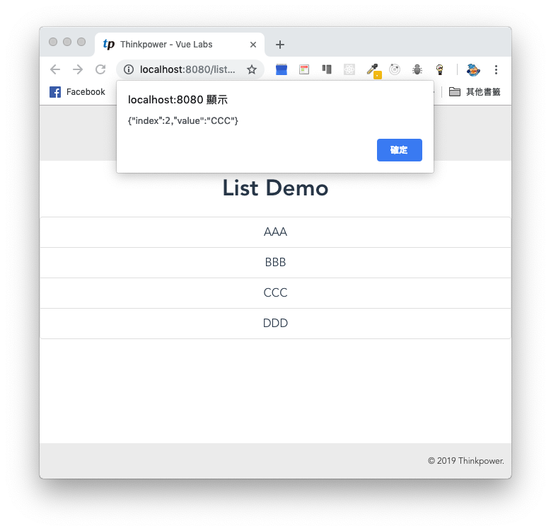
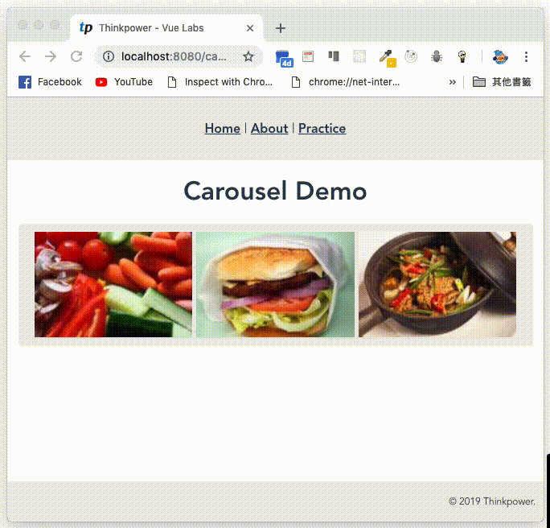

# Thinkpower - Vue.js Labs #
專案使用 **Vue Cli 3** 建立專案。  
提供開發環境，透過練習項目更了解 Javascript 與 ES 6 語法並且實際練習使用 Vue.js，以達到熟悉使用 Vue.js 開發之目的。此練習專案重點會放在 Vue.js 上面，對於 javascript 的語言特性與新版語法沒有太多著墨。文件最後會附上所有相關的參考資料連結，可依需要自行查閱。

***
## 行前準備 ##
1. 了解 **nvm** 為何？如何使用。
2. 了解 **npm** 為何？如何使用。
3. 具備**網頁**開發的基本知識(**HTML**、**CSS**、**Javascript**)。
4. 了解 **Javascript** 與 **ES 6** 語法。  
5. 了解 **git** 版本控管的原理與操作。

***
## 環境準備 ##
1. 安裝 **git**。
2. 安裝 **nvm**，管理 nodejs 版本。
3. 使用 nvm 安裝 **nodejs** ，nodejs 版本需為 **8.12.0 以上**。
4. 安裝 **Visual Studio Code**。
5. Visual Studio Code 安裝擴充功能：**ESLint**、**Vetur**、**Path Autocomplete**。
6. Firefox 或 Chrome 安裝 **vue-devtools** ，用來 debug。 

***
## 專案安裝 ##
* 下載 com.thinkpower.vuelab 專案。
* 在命令提示字元/終端機將目錄移至 com.thinkpower.vuelab 資料夾。
* 執行下列指令安裝 npm package 。  
```
npm install
```
* 移除專案內的 .git 資料夾，並且在 bitbucket 新增一個私有的 repository，將程式碼簽入。後續每完成一個練習就 commit 一次。  

***
## 啟動 Mock Api 服務 ##
```
npm run start-mock
```
**啟動成功後請不要關閉命令提示字元/終端機視窗，網站服務才能使用**  
練習項目時會使用到，於開發期間啟動此服務  
執行成功後開啟 http://localhost:9999/ ，畫面如下  
  

***
## 專案執行(開發) ##
```
npm run dev
```
**啟動成功後請不要關閉命令提示字元/終端機視窗，網站才能使用**  
執行成功後開啟 http://localhost:8080/ ，畫面如下  
  

***
## 專案結構 ##
* **public/** – 靜態檔案資料夾，直接複製到打包後的資料夾  
* **src/assets/** – 程式使用到的 全域css、字型、圖片檔案  
* **src/components/** – 共用組件  
* **src/constant/** – 常數設定  
* **src/router/** – 路由設定  
* **src/services/** – 共用邏輯服務，例如：呼叫 API 的服務、共用(商業)邏輯  
* **src/setup/** – 全域 plugin、filter、mixin… 設定  
* **src/store/** – 全域狀態存放位置(vuex 狀態管理)  
* **src/utils/** – 共用工具，例如：helpr、vee validators(custom rules、message)、filter…  
* **src/views/** – 功能頁面  
* **src/App.vue** – Vue 主組件  
* **src/main.js** – 程式進入點  
* **vue.config.js** – vue cli 3 設定檔  

***
## 專案全域可使用物件 ##
* **jQuery**、**$**
* **moment**

***
## 組件命名規則 ##
  

* 包含 **compoments**、**views** 。  
* 使用**資料夾**做區隔。  
* 使用**大駝峰**命名。  
* 一律以 **index.vue** 做為組件的主程式。  
* 組件內的組件若為非共用組件直接新增 .vue 檔案並且以**大駝峰**命名。  

***
## 組件在 template 使用的名稱規則 ##
  
* 名稱與 binding 屬性(props)一律改為 **kebab-case**。(例如：PopupModal 寫成 popup-modal，isOpen 改為 is-open。)
> 提示：  
> 可安裝 Visual Studio Code 的 **change-case** 擴充套件，該套件可透過指令或設定快速鍵自動將大駝峰的格式轉為kebab-case。
***
## Javascript 函式或方法註解規則 ##
  

* 需在函式或方法增加 [JSDoc](https://docs.microsoft.com/zh-tw/visualstudio/ide/create-jsdoc-comments-for-javascript-intellisense) 註解。
* 必需說明的項目為 **`@description`**(功能說明)、**`@param`**(參數型態、用途說明) 、**`@returns`**(回傳值型態與說明，無回傳值時不需註解)。
## 練習項目 ##
> **注意：請依照上述的專案構結、命名規則與練習項目提供的畫面圖片進行開發。**  
### **※項目 1. 新增一個練習項目清單頁面，透過選單連結可以開啟該頁面。** ###
  **需求說明**  
      
    1. 建立一個 Practice 頁面，預設畫面上的清單要有一個"Home"的連結可連到首頁，後續練習項目如有新增路由與頁面再增加到"練習項目清單"。  
    2. 路由名稱為"practice"，網址路徑為"/practice"。  
    3. 在選單上增加"Practice"連結，點擊後連結至剛剛新建之頁面。  

### **※項目 2. 建立一個計數器頁面，可透過 Practice 頁面上練習項目清單的 Counter 連結開啟該頁。** ###
    
  **需求說明**  
    1. 建立一個 Counter 頁面。  
    2. 每次進入頁面時，計數都**從 0 開始**。  
    3. 按下"**減 1**"按鈕後，計數就 -1。  
    4. 按下"**加 1**"按鈕後，計數就 +1。  
    5. Counter 頁面路由名稱為"counter"，網址路徑為"/counter"。  
    6. 在 Practice 頁面上的練習項目清單，加上 Counter 連結，連結文字為"Counter"，點擊後會轉至 Counter 頁面。  

### **※項目 3. 建立一個清單搜尋頁面，會依照輸入的關鍵字(不分大小寫)即時過濾畫面顯示的清單，並顯示目前清單筆數，可透過 Practice 頁面上練習項目清單的 Search 連結開啟該頁。** ###
    
    
  **需求說明**  
    1. 建立一個 Search 頁面。  
    2. 預設清單資料為一個字串陣列有12筆資料，資料如下  
    **['Ada','Aaliyah','Adela','Basia','Bonnie','Brook','Candice','Celeste','Cheryl','Ella','Eudora','Gemma']**  
    3. **預設**關鍵字輸入欄位值為空，畫面會顯示所有清單資料，並且顯示目前清單筆數。  
    4. 當使用者在關鍵字欄位輸入資料後，會依照輸入的關鍵字即時過瀘畫面顯示的清單，畫面上顯示的清單資料筆數也要跟著更新，比對規則**不分大小寫**。  
    5. Search 頁面路由名稱為"search"，網址路徑為"/search"。  
    6. 在 Practice 頁面上的練習項目清單，加上 Search 連結，連結文字為"Search"，點擊後會轉至 Search 頁面。  

### **※項目 4. 建立一個能把數字轉為有千分位的字串且保留小數位數的 filter，並在頁面展示 filter 的功能。** ###
    
  **需求說明**  
    1. 新建一個 filter 功能，參照目前專案的構結檔案應放置在 /src/utils/filters 下，filter 名稱為"**commafy**"，作法可參考 filters 內的 demo.js。  
    2. 此 filter **可將數字轉為有千分位的字串且保留小數位數**，例如將 10000.00 轉為 10,000.00、1000 轉為 1,000。  
    3. 此 filter function 需加上 JSDoc 註解。  
    4. 建立一個 FilterDemo 頁面，**展示 commafy filter 功能是否符合需求**。  
    5. FilterDemo 頁面的路由名稱為"filterDemo"，網址路徑為"/filterDemo"。  
    6. 在 Practice 頁面上的練習項目清單，加上 FilterDemo 連結，連結文字為"Filter Demo"，點擊後會轉至 FilterDemo 頁面。  

### **※項目 5. 建立一個 List component，可傳入字串陣列資料，點擊項目時會觸發一個自訂事件 clickitem 傳入該項目的資料內容與 index。並且在頁面展示組件的功能。** ###
    
    
  **需求說明**  
    1. 建立一個組件名稱為 **List**。  
    2. 組件必須要有 **data 屬性** **只能傳入字串陣列資料**，如果**沒有資料此組件會自動不顯示**。  
    3. 組件項目被 **click** 時會觸發自訂事件 **clickitem** 並傳入**該項目的資料內容**與**index**。  
    4. 建立一個 ListDemo 頁面，**展示此組件的功能是否符合需求**。  
    5. ListDemo 頁面的路由名稱為"listDemo"，網址路徑為"/listDemo"。  
    6. 在 Practice 頁面上的練習項目清單，加上 ListDemo 連結，連結文字為"List Demo"，點擊後會轉至 ListDemo 頁面。  

### **※項目 6. 把頁面上的選單改寫為 component，原有的樣式、功能都要與原本相同。** ###
    
  **需求說明**  
    1. 組件名稱為 **Menu**。  
    2. 組件必須要有 **items 屬性**，傳入所有連結項目的資料。  
    3. 將目前畫面上的選單替換成此組件，替換後頁面呈現要與原本頁面相同。  

### **※項目 7. 建立一個 popup modal component。** ###
    
    
  **需求說明**  
    1. 建立一個組件名稱為 **PopupModal**。  
    2. 組件必須要有 **title、isOpen 屬性**，title 用來提供標題文字。isOpen 用來控制 modal 的開關。  
    3. 使用 **slot 方式**注入 modal 的**主要內容區塊**。  
    4. 建立一個 ModalDemo 頁面，**展示此組件的功能是否符合需求**。  
    5. ModalDemo 頁面的路由名稱為"modalDemo"，網址路徑為"/modalDemo"。  
    6. 在 Practice 頁面上的練習項目清單，加上 ModalDemo 連結，連結文字為"Modal Demo"，點擊後會轉至 ModalDemo 頁面。  

### **※項目 8. 新增一個使用者註冊頁面，表單需做欄位檢核，並且有送出與清除功能。** ###
    
  **需求說明**  
    1. 建立一個 Register 頁面，頁面有一個表單(form)，表單上有"**送出**"與"**清除**"按鈕。  
    2. 表單需包含以下欄位，**身份証字號**、**姓名**、**性別**、**手機號碼**，欄位的input類型需與畫面相同。  
    3. 使用 **VeeValidate** 套件實作欄位檢核。  
    4. "身份証字號"為必填欄位，資料長度必需為10，且只能填英、數字。  
    5. "姓名"為必填欄位，資料長度上限為30。  
    6. "性別"為必填欄位。  
    7. "手機號碼"為必填欄位，資料長度上限為10，且只能填寫數字。  
    8. 未通過必填欄位檢核顯示錯誤訊息為"**此欄位為必填欄位。**"，其餘錯誤皆顯示"**輸入格式錯誤，請重新輸入。**"。  
    9. 按下**送出**時，若通過檢核以 window.alert 顯示使用者填寫的資料。若有任一欄位未通過檢核該欄位下方應顯示錯誤訊息，且不會有彈跳視窗顯示使用者填寫的資料。  
    10. 按下**清除**時，需清除表單內所有欄位的值與檢核未通過的錯誤訊息。  
    11. Register 頁面路由名稱為"register"，網址路徑為"/register"。  
    12. 在 Practice 頁面上的練習項目清單，加上 Register 連結，連結文字為"Register"，點擊後會轉至 Register 頁面。  

### **※項目 9. 呼叫 API 取得產品資料在畫面顯示並且可查看產品明細資料。** ###
    
    
  **需求說明**  
    1. 建立一個 AjaxDemo 頁面，用來呈現呼叫 API 後取得的產品清單，每筆資料顯示欄位 **prodName**(品名)、**prodImg**(產品圖片)。  
    2. 點擊清單項目後，以該筆資料的 prodId(產品 id) 再呼叫 API 取得產品明細資料，使用"練習項目8"製作的 PopupModal 組件顯示明細資料，顯示欄位為 **prodId**(產品 id)、**prodName**(品名)、**prodImg**(產品圖片)、**amount**(售價)、**width**(寬)、**height**(高)、**weight**(重量)、**description**(說明)，PopupModal 要有"關閉"按鈕，點擊後可關閉。  
    3. 當產品清單 API 回覆 isSuccess 為 false 或者 data 資料筆數為 0 筆時，畫面要顯示 "查無資料"。  
    4. 當產品明細 API 回覆 isSuccess 為 false 時，以 window.alert 顯示 message 欄位訊息，。  
    5. 掛載 **vue-axios**，使用 axios 呼叫 API。  
    6. AjaxDemo 頁面路由名稱為"ajaxDemo"，網址路徑為"/ajaxDemo"。  
    7. 在 Practice 頁面上的練習項目清單，加上 AjaxDemo 連結，連結文字為"Ajax Demo"，點擊後會轉至 AjaxDemo 頁面。  
    8. API 規格如下，資料為隨機產生(**需啟動 Mock Api 服務,請注意 API URL 預設為 localhost:9999，若 port 號先被佔用可能會不同**)。  
    **產品清單 API**  
    URL：http://localhost:9999/product/list  
    Method： POST  
    Request：
    ```
    {}
    ```  
    Response：
    ```
    {
        "isSuccess": true,
        "message": "",
        "data": [
            {
                "prodId": "ff36a0b8-8726-47f6-9f8a-964b4e4b6f7a",
                "prodName": "channels index",
                "prodImg": "img url"
            },
            {
                "prodId": "464cf7bb-63f4-4d26-9269-23ee289050dd",
                "prodName": "global Concrete",
                "prodImg": "img url"
            }
        ]
    }
    ```  
    **產品明細 API**  
    URL：http://localhost:9999/product/detail  
    Method： POST  
    Request：
    ```
    {"prodId": "464cf7bb-63f4-4d26-9269-23ee289050dd"}
    ```  
    Response：
    ```
    {
        "isSuccess": true,
        "message": "",
        "data": {
            "prodId": "464cf7bb-63f4-4d26-9269-23ee289050dd",
            "prodName": "Unbranded Granite Shirt",
            "prodImg": "img url",
            "amount": "2040",
            "width": "190 mm",
            "height": "145 mm",
            "weight": "185 公克",
            "description": "aut cum facilis cumque labore quas"
        }
    }
    ```  

### **※項目 10. 建立一個頁面，頁面上有個 input 與按鈕當按下按鈕後，要將 focus 移至 input 上。** ###
    
  **需求說明**  
    1. 建立一個 RefDemo 頁面，頁面上有個 input 與按鈕。  
    2. 按下 Set Focus 按鈕後，要將 focus 移至 input 上。  
    3. RefDemo 頁面路由名稱為"refDemo"，網址路徑為"/refDemo"。  
    4. 在 Practice 頁面上的練習項目清單，加上 RefDemo 連結，連結文字為"Ref Demo"，點擊後會轉至 RefDemo 頁面。  

### **※項目 11. 建立一個頁面，頁面上要有可以左右滑動、自動輪播圖片的區塊，並且資料由 API 取得。** ###
    
  **需求說明**  
    1. 建立一個 CarouselDemo 頁面，頁面上要有左右滑動、自動輪播區塊，一次顯示 3 個圖片。  
    2. 使用 **Owl Carousel 2** 套件實現頁面上要有左右滑動、自動輪播區塊，一次顯示 3 個圖片的功能。  
    3. 使用 axios 呼叫 API 取得**產品清單資料**，只需取用 **prodImg** 欄位來顯示。  
    4. CarouselDemo 頁面路由名稱為"carouselDemo"，網址路徑為"/carouselDemo"。  
    5. 在 Practice 頁面上的練習項目清單，加上 CarouselDemo 連結，連結文字為"Carousel Demo"，點擊後會轉至 CarouselDemo 頁面。  
    6. API 規格如下，資料為隨機產生(**需啟動 Mock Api 服務,請注意 API URL 預設為 localhost:9999，若 port 號先被佔用可能會不同**)。  
    **產品清單 API**  
    URL：http://localhost:9999/product/list  
    Method： POST  
    Request：
    ```
    {}
    ```  
    Response：
    ```
    {
        "isSuccess": true,
        "message": "",
        "data": [
            {
                "prodId": "ff36a0b8-8726-47f6-9f8a-964b4e4b6f7a",
                "prodName": "channels index",
                "prodImg": "img url"
            },
            {
                "prodId": "464cf7bb-63f4-4d26-9269-23ee289050dd",
                "prodName": "global Concrete",
                "prodImg": "img url"
            }
        ]
    }
    ```  

### **※項目 12. 建立一個計數器頁面，可透過 Practice 頁面上練習項目清單的 CounterWithState 連結開啟該頁。** ###
    
  **需求說明**  
    1. 建立一個 CounterWithState 頁面，**使用 Vuex 將計數值儲存在 state**。  
    2. 計數**初始值為 0** ，如果**離開頁面再回來，計數數字會與上一次離開頁面時的數字相同**。  
    3. 按下"**減 1**"按鈕後，計數就 -1。  
    4. 按下"**加 1**"按鈕後，計數就 +1。  
    5. CounterWithState 頁面路由名稱為"counterWithState"，網址路徑為"/counterWithState"。  
    6. 在 Practice 頁面上的練習項目清單，加上 CounterWithState 連結，連結文字為"Counter With State"，點擊後會轉至 CounterWithState 頁面。   

***
## 參考資料 ##
* 為你自己學 Git - https://gitbook.tw
* Bitbucket - https://bitbucket.org
* nvm - https://github.com/creationix/nvm  
* npm - https://docs.npmjs.com
* ECMAScript 6 入門 - http://es6.ruanyifeng.com
* JSDoc 說明 - https://docs.microsoft.com/zh-tw/visualstudio/ide/create-jsdoc-comments-for-javascript-intellisense
* Sass - https://sass-lang.com
* Vue CLI 3 - https://cli.vuejs.org/guide/
* Vue.js - https://vuejs.org
* Vue.js Lifecycle Diagram - https://vuejs.org/v2/guide/instance.html#Lifecycle-Diagram
* Vue.js API Cheat Sheet - https://vuejs-tips.github.io/cheatsheet/
* Vuex Cheat Sheet - https://vuejs-tips.github.io/vuex-cheatsheet/
* axios - https://github.com/axios/axios  
* vue-axios - https://github.com/imcvampire/vue-axios#readme  
* VeeValidate - https://baianat.github.io/vee-validate/
* vue-devtools - https://github.com/vuejs/vue-devtools#vue-devtools  
* Owl Carousel 2 - https://github.com/OwlCarousel2/OwlCarousel2  
